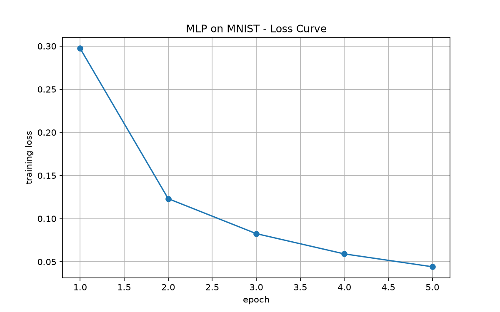
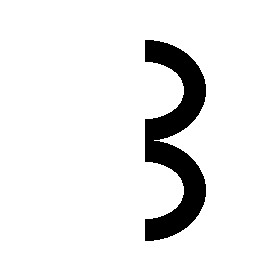

# dian —— 2026 团队秋招算法题

按 Level 递进完成从 MLP 到 U-Net 的完整链路，每个 Level 独立成目录，共享一份数据集。

| Level | 内容 | 状态 |
|---|---|---|
| L0 | conda 环境管理与 GPU 加速验证 | ✅ 完成 |
| L1 | MLP 手写数字识别（MNIST） | ✅ 完成 |
| L2 | CNN 对比实验 | ⏳ 进行中 |
| L3 | 经典 CNN 结构（AlexNet / VGG / ResNet / U-Net） | ⏳ 未开始 |
| L4 | U-Net 手写笔记擦除 | ⏳ 未开始 |

## 环境

- 硬件：MacBook Air（Apple Silicon / arm64）
- 环境：conda 环境 `dian`，Python 3.11.9
- 关键依赖：PyTorch 2.14.0、torchvision、matplotlib、Pillow
- 加速后端：**MPS**。Mac 无 NVIDIA 显卡，因此不能使用 CUDA，代码统一走 `torch.backends.mps.is_available()` 判断

复现环境：

```bash
conda create -n dian python=3.11.9
conda activate dian
pip install torch torchvision matplotlib pillow
```

## 目录结构

```
dian/
├── data/                    # 共享数据集（MNIST，被 .gitignore 排除）
├── level1/
│   ├── model.py             # MLP 模型定义（含自测入口）
│   ├── train.py             # 训练脚本：从零训练并保存权重与曲线
│   ├── infer.py             # 推理脚本：对测试集或外部图片做单张预测
│   ├── level1mlp.ipynb      # 逐段搭建过程的实验记录
│   ├── samples/             # 用于验证 infer.py 的外部图片
│   ├── mlp_mnist.pt         # 训练产物：权重（被 .gitignore 排除）
│   ├── loss_curve.png       # 训练产物：Loss 曲线
│   └── 学习笔记_Level1.md    # 概念梳理与踩坑记录
└── step1_preview_data.py    # 数据下载与预览
```

**关于路径**：所有脚本用 `Path(__file__).resolve()` 锚定绝对路径，因此**可以在任意目录下运行**，产物固定落在 `level1/`，数据集固定指向 `data/`，不会因为当前目录不同而重复下载。

## Level 1：MLP 手写数字识别

### 模型结构

```
输入 [N, 1, 28, 28]
  → Flatten        展平成 [N, 784]
  → Linear(784, 256) + ReLU
  → Linear(256, 10)              输出 10 类 logits
```

- 参数量：**203,530**
- 隐藏层只有 1 层（256 个神经元），结构刻意保持最小，便于观察训练行为

### 训练配置

| 项 | 值 |
|---|---|
| 数据集 | MNIST，训练 60000 / 测试 10000 |
| batch size | 64 |
| 优化器 | Adam，学习率 1e-3 |
| 损失函数 | CrossEntropyLoss |
| epoch | 5（每 epoch 约 938 次参数更新，共约 4690 次） |

### 结果

| 指标 | 数值 |
|---|---|
| 训练 loss | 约 0.30（epoch 1）→ 约 0.05（epoch 5） |
| 测试集准确率 | **97.68%**（9768 / 10000） |

**Loss 曲线**（由 `train.py` 自动生成并保存）：



曲线呈典型的"先陡后缓"形态：epoch 1→2 下降最快（0.30 → 0.12），此后收益递减，epoch 5 时已趋平缓——说明继续加大 epoch 的边际收益很小，5 个 epoch 对这个任务已经够用。

准确率由**加载落盘权重**后重新评估得到，验证了权重文件本身可用、结果可复现。

### 数据划分与防数据泄露

数据使用严格按"训练/测试"两摞分离：

| 用途 | 数据来源 | 数量 | 参与训练？ |
|---|---|---|---|
| 训练 | MNIST train 集 | 60000 | ✅ 是 |
| 测试 | MNIST test 集 | 10000 | ❌ 否，仅在训练全部结束后评估一次 |

关键点：**测试集在训练过程中从未被访问**，没有参与任何一次参数更新，也没有用于挑选超参数。测试集的唯一作用是训练结束后给出一次性的最终成绩，因此 97.68% 这个数字反映的是模型在**未见数据**上的真实能力，不存在数据泄露。

（`train.py` 中保留了 `random_split` 切分验证集的代码，供后续需要调参时启用：调参只看验证集，最后才碰测试集。）

### Level 1 验收标准对照

| 验收标准（题目原文） | 本仓库对应实现 |
|---|---|
| 不数据泄露，测试集准确率达到 90% | 97.68%（测试集全程不参与训练，见上表） |
| 能训练模型 | `level1/train.py`，`python level1/train.py` 从零训练 |
| 能推理模型 | `level1/infer.py`，支持测试集图片与外部图片 |
| 可视化、保存 Loss 曲线 | `level1/loss_curve.png`，由 `train.py` 用 matplotlib 生成并保存 |
| README 记录网络结构、超参数和实验结果 | 见上文"模型结构""训练配置""结果"三节 |

### 运行方式

```bash
conda activate dian
cd dian

# 训练：从零训练，产出 level1/mlp_mnist.pt 与 level1/loss_curve.png
python level1/train.py

# 推理：默认取测试集第 0 张
python level1/infer.py

# 推理：对指定图片
python level1/infer.py level1/samples/digit7.png
```

推理脚本输出示例（同时对测试集与外部图片验证）。用于验证的外部图片（白底黑笔迹，经 `infer.py` 的反色、缩放等预处理后送入模型）：

<p align="center">
  
  
</p>

```
# 测试集第 0 张
真实标签: 7
模型预测: 7
10 类得分: [-4.16, -7.73, -2.17, 0.24, -15.67, -5.57, -18.61, 9.97, -2.54, -2.19]
各类概率: ['0.00%', '0.00%', '0.00%', '0.01%', '0.00%', '0.00%', '0.00%', '99.99%', '0.00%', '0.00%']
最高置信度: 99.99%

# samples/digit7.png（外部图片，没有标注）
真实标签: 未知
模型预测: 7
最高置信度: 98.20%
```

`10 类得分`是 softmax 之前的原始 logits（范围无界、可为负），`各类概率`是 softmax 之后的归一化结果。两者对照可以看出 softmax 的**指数放大效应**：logits 只领先 8 分左右，概率上就变成 99.99% —— 所以"高置信度"不等于"高把握"。

---

## Level 1 理解题

### 1. MLP 的输入是什么样子的？图片是怎么被输入进去的？

MLP 从未接触过"图片"，它只接收**一个 784 维向量**。一张 28×28 灰度图进入网络前经过三步处理：

1. 读入并转单通道灰度，得到 28×28 的像素强度矩阵（0 = 纯黑，255 = 纯白）
2. `ToTensor()` 把值域从 0~255 压到 0~1，并补上通道维，形状为 `[1, 28, 28]`
3. `nn.Flatten()` 把二维矩阵按行展开成一维，28×28 = **784 个数**

所以第一层实际接收的形状是 `[64, 784]`（一批 64 张），`Linear(784, 256)` 做的是一次矩阵乘法：`[64,784] @ [784,256] = [64,256]`。

**关键点**：Flatten 之后，像素之间的**空间邻接关系被彻底丢弃**。对 MLP 来说，把一张图的所有像素打乱顺序再输入，难度完全一样 —— 它无法利用"相邻像素相关"这一图像的基本先验。这正是 MLP 处理图像的先天缺陷，也是 Level 2 转向 CNN 的根本动机。

### 2. 未经训练的 MLP 输出完全错误，训练是如何让它越来越正确的？

训练回路是：**前向 → 损失 → 反向传播 → 更新参数**，循环约 4690 次。

1. **初始化时它是垃圾**：`MLP()` 的权重是随机数，输出无意义，准确率约 10%（10 类随机猜的水平）。
2. **损失函数量化"错得有多离谱"**：`CrossEntropyLoss` 比较模型打分与真实标签，输出一个标量。起点约 2.3，接近 10 类均匀分布时的理论值 `-ln(1/10)`。
3. **反向传播算出"该往哪调"**：利用链式法则求损失对**每个参数的偏导数**（梯度）。梯度的含义很具体 —— "这个参数往正方向挪一点，损失会变大多少"。既然知道哪个方向让错误变大，就往反方向走。
4. **优化器执行一步**：`optimizer.step()` 让全部 20 万个参数各挪一小步，步长由学习率控制，随后 `zero_grad()` 清空梯度、进入下一批。

**核心认知：模型不知道"正确答案是什么"，它只知道"往哪个方向走能少错一点"。** 20 万维参数空间中，损失构成一张超曲面，训练就是在曲面上沿负梯度方向逐步下行。

之所以能学会，是因为"哪些像素组合对应哪个数字"这条规律由 6 万张图共同约束 —— 单张样本带噪声，但 6 万张的合力指向真实的统计规律。因此最终实现的不是"背下训练集"，而是在从未见过的 1 万张测试图上也有 97.68% 的准确率。

### 3. 如何理解"基于数据的逆向映射"？它与"对输入做变换"有什么区别？

**对输入做变换**（正向）：规则由人写死，输入决定输出且结果唯一确定。反色、缩放、旋转都属于此类，特点是规则先于数据存在，且通常可逆。

**基于数据的逆向映射**（学习）：没有规则，只有一批 `(输入, 输出)` 样例对，目标是反推出一个函数 `f` 使 `f(x) ≈ y`。三点本质区别：

1. **规则来源不同** —— 变换是"先有规则，再算结果"；学习是"先有例子，再猜规则"。"如何识别数字 7"这条规则无法用 if-else 手写出来，所以才必须让模型从数据中拟合。
2. **解不唯一、也不精确** —— 同一批数据可以拟合出无数个 `f`。换一组随机初始化、换一种网络结构、换个学习率，最终 20 万个参数完全不同，但测试准确率可能都是 97% 左右。训练出的模型不是唯一正解，而是众多可行解之一（这也是同一份代码换台机器跑，数字会有细微差异的原因）。
3. **只在训练分布内有效** —— 变换对任何输入都成立，而学出来的映射只对"与训练数据同分布"的输入有效。把 MNIST 图像上下颠倒、或用手机拍的正常照片，准确率都会明显下降，因为那已偏离训练分布。

一句话概括：**正向变换是"算"（规则明确、结果确定），逆向映射是"猜 + 用误差修正猜"（规则未知，靠数据约束方向，只能逼近）。**

这也解释了为什么必须保留测试集：既然学出来的映射只保证在见过的数据上有效，就需要一批**训练时从未接触过**的数据来衡量真实能力。

---

## 已知局限与后续改进

1. **未切分验证集**：当前 `train.py` 使用全部 60000 张训练图（`random_split` 的切分代码已写好但被注释）。本 Level 未做超参数搜索，因此测试集仍然只被使用一次、不存在泄露；但若后续要调参，应恢复验证集切分，坚持"调参只看验证集"。
2. **外部手写图准确率下降**：`samples/` 中的合成图能正确识别，但真实拍摄的手写数字容易出错，原因有三层 —— ① MNIST 的数字都是居中被裁切的，而照片不会自动居中对齐；② 拍摄图存在阴影、噪点、纸张纹理；③ 笔迹风格与 MNIST 的书写者不同，属于分布外输入。
3. **空间信息被展平丢弃**：这是 MLP 的结构性限制，Level 2 引入卷积后解决。
4. **权重文件未纳入版本库**：`*.pt` 与 `data/` 已在 `.gitignore` 中排除。权重可由 `train.py` 复现，无需提交二进制文件。
